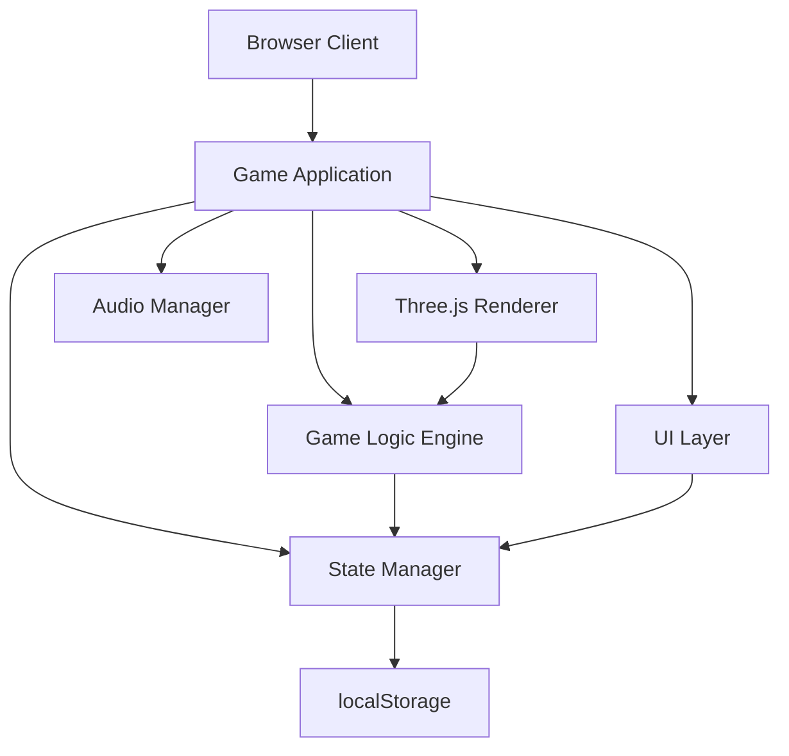
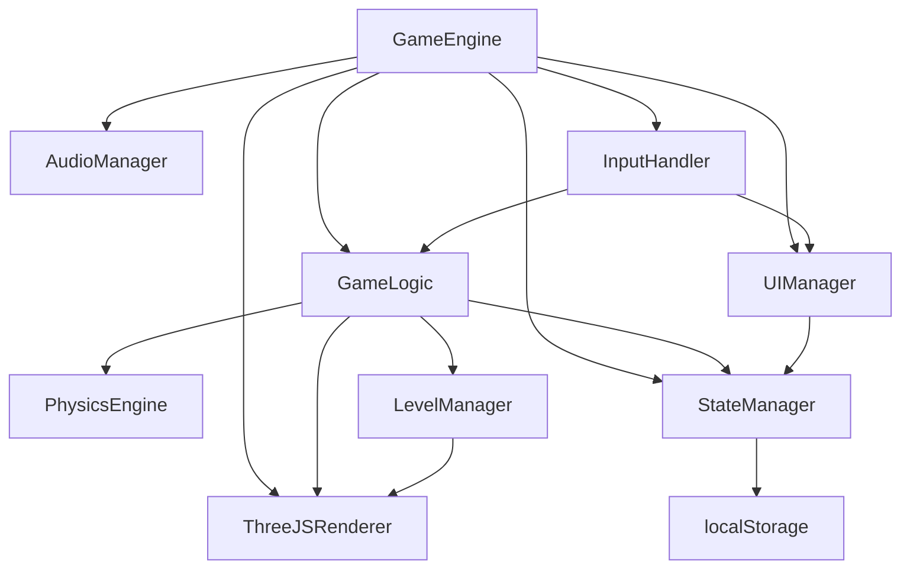
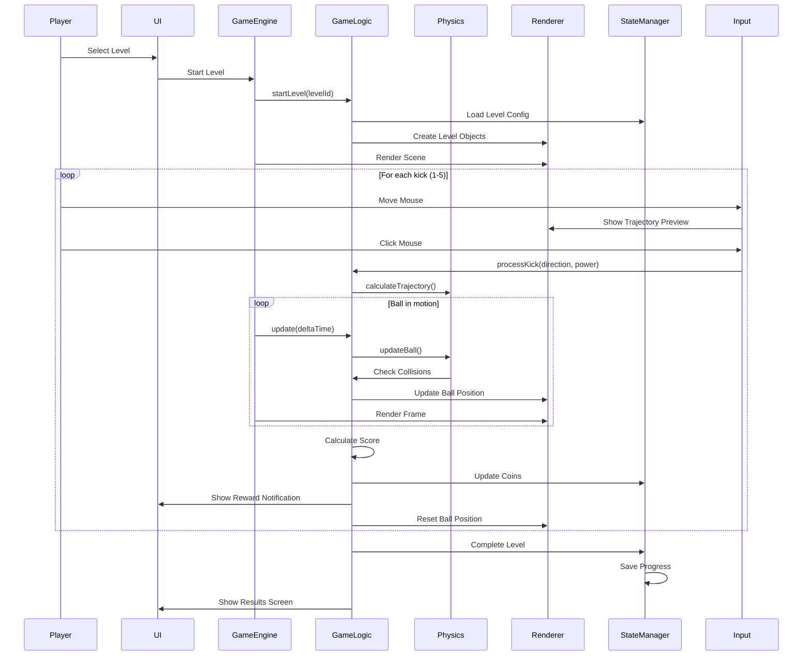
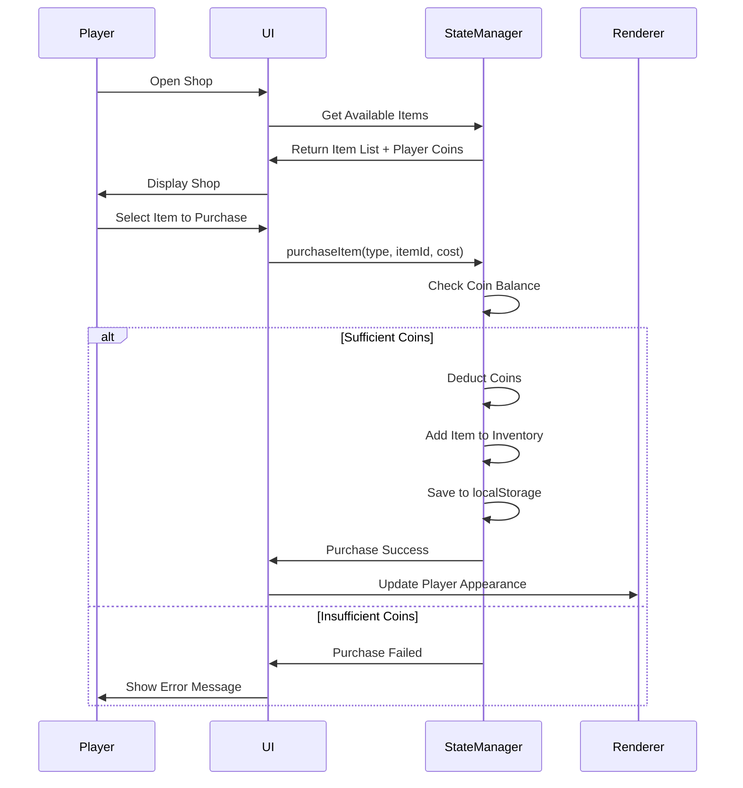

# Free Kick Master Architecture Document

## Introduction

This document outlines the overall project architecture for Free Kick Master, a browser-based 3D football arcade game. The architecture is designed as a client-side monolithic application using Three.js for 3D rendering, with all game logic running in the browser and data persistence via localStorage.

**Relationship to Frontend Architecture:**
This is a frontend-only application. All UI, game logic, and 3D rendering are handled client-side. There is no separate backend architecture document needed.

### Starter Template or Existing Project

**Decision:** N/A - Greenfield project. Will use Vite as build tool for fast development and optimized production builds.

### Change Log

| Date | Version | Description | Author |
|------|---------|-------------|--------|
| 2024 | 1.0 | Initial architecture document | BMad Master |

## High Level Architecture

### Technical Summary

Free Kick Master is a client-side monolithic browser application built with Three.js for 3D rendering. The architecture follows a component-based game engine pattern with clear separation between rendering, game logic, state management, and UI layers. All game state is persisted locally using localStorage. The application uses Vite for development tooling and build optimization, ensuring fast load times and 60 FPS performance. This architecture supports the PRD goals of a browser-based game that runs without installation, works in Chrome, and provides smooth 3D gameplay with reward systems.

### High Level Overview

1. **Architectural Style:** Client-side Monolith - All code runs in the browser as a single application bundle
2. **Repository Structure:** Monorepo - Single repository with organized folder structure for code, assets, and documentation
3. **Service Architecture:** N/A - No backend services, all logic is client-side
4. **Primary User Flow:**
   - User opens game in browser → Loads saved progress from localStorage
   - User navigates menus → Selects level → Plays game → Earns coins → Shops for equipment
   - All interactions happen client-side with immediate visual feedback
5. **Key Architectural Decisions:**
   - Three.js for 3D rendering (industry standard, excellent documentation)
   - Component-based game architecture for maintainability
   - Event-driven communication between game systems
   - localStorage for persistence (simple, no backend needed)
   - Vite for build tooling (fast HMR, optimized production builds)

### High Level Project Diagram



### Architectural and Design Patterns

- **Component-Based Architecture:** Game objects (ball, goal, obstacles) are implemented as reusable components with clear interfaces - _Rationale:_ Enables modular development, easier testing, and code reuse across different levels
- **State Management Pattern:** Centralized state manager handles game state, player progress, and UI state - _Rationale:_ Single source of truth, predictable state updates, easier debugging
- **Event-Driven Communication:** Game systems communicate via events (ball kicked, goal scored, level completed) - _Rationale:_ Loose coupling between systems, easier to extend functionality
- **Repository Pattern for Storage:** Abstracted storage layer for localStorage operations - _Rationale:_ Easy to swap storage mechanism if needed, testable storage logic
- **Game Loop Pattern:** Standard game loop (update → render) for consistent frame timing - _Rationale:_ Ensures smooth 60 FPS gameplay, standard game development pattern

## Tech Stack

### Cloud Infrastructure

- **Provider:** Static Hosting (GitHub Pages, Vercel, or Netlify)
- **Key Services:** Static file hosting, CDN for asset delivery
- **Deployment Regions:** Global CDN (provider-dependent)

### Technology Stack Table

| Category | Technology | Version | Purpose | Rationale |
|----------|-----------|---------|---------|-----------|
| **Language** | JavaScript | ES2022 | Primary development language | Native browser support, no compilation needed |
| **Build Tool** | Vite | 5.x | Development server and build tool | Fast HMR, optimized production builds, excellent DX |
| **3D Framework** | Three.js | r160+ | 3D rendering engine | Industry standard, excellent docs, WebGL abstraction |
| **Physics** | Custom | - | Ball physics and collision detection | Lightweight, game-specific physics sufficient |
| **State Management** | Custom | - | Game state and player progress | Simple state needs, no need for Redux/MobX overhead |
| **Storage** | localStorage API | Native | Player progress persistence | Built-in browser API, no backend needed |
| **Audio** | Web Audio API / HTML5 Audio | Native | Sound effects and music | Native browser support, no external dependencies |
| **Styling** | CSS3 | - | UI styling | Native, no framework overhead needed |
| **Testing** | Vitest | Latest | Unit testing | Fast, Vite-native, good TypeScript support |
| **Package Manager** | npm | 10.x | Dependency management | Standard Node.js tooling |

## Data Models

### PlayerProgress

**Purpose:** Stores player's game progress, coins, unlocked levels, and purchased equipment.

**Key Attributes:**
- `coins`: number - Current coin balance
- `unlockedLevels`: number[] - Array of unlocked level IDs (1-5)
- `purchasedUniforms`: string[] - Array of purchased uniform IDs
- `purchasedBalls`: string[] - Array of purchased ball IDs
- `currentUniform`: string - Currently selected uniform ID
- `currentBall`: string - Currently selected ball ID
- `levelStats`: object - Statistics per level (coins earned, goals scored, etc.)

**Relationships:**
- Used by StateManager for persistence
- Updated by GameLogic when player progresses

### LevelConfig

**Purpose:** Configuration data for each game level (obstacles, difficulty, rewards).

**Key Attributes:**
- `id`: number - Level identifier (1-5)
- `name`: string - Level display name
- `obstacles`: object[] - Array of obstacle configurations
- `targetReward`: number - Coins for hitting target (if applicable)
- `goalReward`: number - Coins for scoring goal (10)
- `completionBonus`: number - Bonus coins for completing level (5)

**Relationships:**
- Loaded by LevelManager
- Used by GameLogic to configure level behavior

### GameState

**Purpose:** Current game session state (active level, current kick, ball position, etc.).

**Key Attributes:**
- `currentLevel`: number - Currently active level ID
- `currentKick`: number - Current kick number (1-5)
- `kicksRemaining`: number - Remaining kicks in current level
- `ballPosition`: Vector3 - Current ball position in 3D space
- `ballVelocity`: Vector3 - Current ball velocity
- `isKicking`: boolean - Whether player is currently aiming/kicking
- `score`: object - Current level score (goals, targets hit, coins earned)

**Relationships:**
- Managed by GameLogic
- Updated in real-time during gameplay
- Reset when level starts/completes

## Components

### GameEngine

**Responsibility:** Main game loop coordinator, initializes all systems, manages frame updates and rendering.

**Key Interfaces:**
- `init()` - Initialize game engine and all systems
- `start()` - Start game loop
- `stop()` - Stop game loop
- `update(deltaTime)` - Update game logic
- `render()` - Render frame

**Dependencies:** Three.js Renderer, GameLogic, StateManager, AudioManager

**Technology Stack:** JavaScript, Three.js

### ThreeJSRenderer

**Responsibility:** Manages Three.js scene, camera, lighting, and all 3D object rendering.

**Key Interfaces:**
- `createScene()` - Initialize Three.js scene
- `addObject(object)` - Add 3D object to scene
- `removeObject(object)` - Remove 3D object from scene
- `updateCamera(position, target)` - Update camera position
- `render()` - Render current frame
- `resize(width, height)` - Handle window resize

**Dependencies:** Three.js library

**Technology Stack:** Three.js r160+, WebGL

### GameLogic

**Responsibility:** Core game mechanics - ball physics, collision detection, scoring, level progression.

**Key Interfaces:**
- `startLevel(levelId)` - Initialize and start a level
- `processKick(direction, power)` - Process player kick input
- `updateBall(deltaTime)` - Update ball physics
- `checkCollisions()` - Detect collisions (goal, obstacles, ground)
- `calculateScore(result)` - Calculate coins earned
- `completeLevel()` - Handle level completion

**Dependencies:** StateManager, LevelManager, PhysicsEngine

**Technology Stack:** JavaScript, Custom physics

### PhysicsEngine

**Responsibility:** Handles ball trajectory calculations, gravity, and collision detection.

**Key Interfaces:**
- `calculateTrajectory(startPos, direction, power)` - Calculate ball path
- `updatePosition(currentPos, velocity, deltaTime)` - Update position based on physics
- `checkGoalCollision(ballPos, goalBounds)` - Check if ball entered goal
- `checkObstacleCollision(ballPos, obstacles)` - Check obstacle collisions

**Dependencies:** None (pure calculations)

**Technology Stack:** JavaScript, Vector math

### StateManager

**Responsibility:** Manages game state, player progress, and localStorage persistence.

**Key Interfaces:**
- `getProgress()` - Get player progress from storage
- `saveProgress(progress)` - Save player progress
- `updateCoins(amount)` - Update coin balance
- `unlockLevel(levelId)` - Unlock a level
- `purchaseItem(type, itemId, cost)` - Handle shop purchases
- `getGameState()` - Get current game session state
- `setGameState(state)` - Update game session state

**Dependencies:** localStorage API

**Technology Stack:** JavaScript, localStorage

### LevelManager

**Responsibility:** Loads and manages level configurations, creates level objects.

**Key Interfaces:**
- `loadLevel(levelId)` - Load level configuration
- `createLevelObjects(levelConfig)` - Create 3D objects for level
- `getLevelConfig(levelId)` - Get level configuration data

**Dependencies:** ThreeJSRenderer, LevelConfig data

**Technology Stack:** JavaScript, Three.js

### UIManager

**Responsibility:** Manages all UI screens (menus, HUD, shop, results), handles user input.

**Key Interfaces:**
- `showScreen(screenName)` - Display a UI screen
- `updateHUD(data)` - Update in-game HUD
- `showRewardNotification(amount, reason)` - Show coin reward notification
- `handleMenuNavigation(action)` - Handle menu button clicks

**Dependencies:** StateManager, GameEngine

**Technology Stack:** HTML5, CSS3, JavaScript

### AudioManager

**Responsibility:** Manages sound effects and background music playback.

**Key Interfaces:**
- `playSound(soundId)` - Play sound effect
- `playMusic(musicId, loop)` - Play background music
- `setVolume(volume)` - Set audio volume
- `stopMusic()` - Stop background music

**Dependencies:** Web Audio API / HTML5 Audio

**Technology Stack:** Web Audio API, HTML5 Audio

### InputHandler

**Responsibility:** Handles mouse input for kick direction/power, UI interactions.

**Key Interfaces:**
- `onMouseMove(callback)` - Register mouse move handler
- `onMouseClick(callback)` - Register mouse click handler
- `getMouseWorldPosition()` - Convert screen coordinates to 3D world position
- `calculateKickParameters(mousePos, ballPos)` - Calculate kick direction and power

**Dependencies:** Three.js (for coordinate conversion)

**Technology Stack:** JavaScript, DOM Events

## Component Diagrams



## Core Workflows

### Level Play Workflow



### Shop Purchase Workflow



## Source Tree

```
free_kick_master/
├── src/
│   ├── core/
│   │   ├── GameEngine.js          # Main game loop
│   │   ├── GameLogic.js           # Core game mechanics
│   │   └── StateManager.js        # State and persistence
│   ├── rendering/
│   │   ├── ThreeJSRenderer.js     # Three.js wrapper
│   │   ├── SceneManager.js        # Scene setup
│   │   └── CameraController.js    # Camera management
│   ├── physics/
│   │   ├── PhysicsEngine.js       # Ball physics
│   │   └── CollisionDetector.js   # Collision detection
│   ├── game/
│   │   ├── Ball.js                # Ball component
│   │   ├── Goal.js                # Goal component
│   │   ├── Goalkeeper.js          # Goalkeeper AI
│   │   ├── Wall.js                # Wall obstacle
│   │   └── Target.js              # Moving targets
│   ├── levels/
│   │   ├── LevelManager.js        # Level loading
│   │   ├── Level1.js              # Level 1 config
│   │   ├── Level2.js              # Level 2 config
│   │   ├── Level3.js              # Level 3 config
│   │   ├── Level4.js              # Level 4 config
│   │   └── Level5.js              # Level 5 config
│   ├── ui/
│   │   ├── UIManager.js           # UI controller
│   │   ├── screens/
│   │   │   ├── MainMenu.js        # Main menu screen
│   │   │   ├── LevelSelect.js     # Level selection
│   │   │   ├── GameHUD.js         # In-game HUD
│   │   │   ├── ResultsScreen.js   # Level results
│   │   │   ├── Shop.js            # Shop screen
│   │   │   └── Profile.js         # Player profile
│   │   └── components/
│   │       ├── Button.js          # Reusable button
│   │       └── CoinDisplay.js     # Coin counter
│   ├── audio/
│   │   ├── AudioManager.js        # Audio controller
│   │   └── sounds/                # Audio files
│   │       ├── kick.mp3
│   │       ├── goal.mp3
│   │       ├── miss.mp3
│   │       └── menu-music.mp3
│   ├── input/
│   │   └── InputHandler.js        # Mouse input handling
│   ├── shop/
│   │   ├── ShopManager.js         # Shop logic
│   │   ├── uniforms.js            # Uniform catalog
│   │   └── balls.js               # Ball catalog
│   ├── utils/
│   │   ├── math.js                # Math utilities
│   │   └── storage.js             # localStorage helpers
│   └── main.js                    # Application entry point
├── public/
│   ├── index.html                 # HTML entry point
│   ├── assets/
│   │   ├── models/                # 3D models (if any)
│   │   ├── textures/              # Textures
│   │   └── sounds/                # Audio files
│   └── favicon.ico
├── docs/
│   ├── prd.md                     # Product Requirements
│   └── architecture.md            # This document
├── .gitignore
├── package.json
├── vite.config.js                 # Vite configuration
├── README.md                       # Project documentation
└── LICENSE
```

## Infrastructure and Deployment

### Infrastructure as Code

- **Tool:** N/A - Static hosting, no infrastructure code needed
- **Location:** N/A
- **Approach:** Static file deployment

### Deployment Strategy

- **Strategy:** Static file deployment to CDN
- **CI/CD Platform:** GitHub Actions (if using GitHub Pages) or provider-native CI/CD
- **Pipeline Configuration:** `.github/workflows/deploy.yml` (if using GitHub Actions)

### Environments

- **Development:** Local Vite dev server (`npm run dev`)
- **Production:** Static hosting (GitHub Pages, Vercel, or Netlify)

### Environment Promotion Flow

```
Local Development → Build → Deploy to Production
```

### Rollback Strategy

- **Primary Method:** Git revert + redeploy
- **Trigger Conditions:** Critical bugs, broken gameplay
- **Recovery Time Objective:** < 5 minutes (static hosting redeploy is fast)

## Error Handling Strategy

### General Approach

- **Error Model:** Try-catch blocks with user-friendly error messages
- **Exception Hierarchy:** Custom error classes for game-specific errors
- **Error Propagation:** Errors logged to console in development, silent failures with fallbacks in production

### Logging Standards

- **Library:** Native `console` API (development), silent in production
- **Format:** `[Component] Message: Details`
- **Levels:** `error`, `warn`, `info`, `debug`
- **Required Context:**
  - Component name
  - Error message
  - Stack trace (development only)

### Error Handling Patterns

#### External API Errors
- **Retry Policy:** N/A - No external APIs
- **Circuit Breaker:** N/A
- **Timeout Configuration:** N/A
- **Error Translation:** N/A

#### Business Logic Errors
- **Custom Exceptions:** `InsufficientCoinsError`, `LevelLockedError`, `InvalidKickError`
- **User-Facing Errors:** Friendly messages displayed in UI
- **Error Codes:** String-based error codes for UI display

#### Data Consistency
- **Transaction Strategy:** localStorage operations are atomic
- **Compensation Logic:** Validate before save, rollback on failure
- **Idempotency:** Save operations are idempotent (overwrite existing data)

## Coding Standards

### Core Standards

- **Languages & Runtimes:** JavaScript ES2022, modern browser APIs
- **Style & Linting:** ESLint with recommended rules, Prettier for formatting
- **Test Organization:** Tests in `src/**/*.test.js` files alongside source

### Naming Conventions

| Element | Convention | Example |
|---------|-----------|---------|
| Classes | PascalCase | `GameEngine`, `Ball` |
| Functions/Methods | camelCase | `startLevel`, `calculateTrajectory` |
| Constants | UPPER_SNAKE_CASE | `MAX_KICKS`, `GOAL_REWARD` |
| Variables | camelCase | `currentLevel`, `ballPosition` |
| Files | PascalCase for classes, camelCase for utilities | `GameEngine.js`, `mathUtils.js` |

### Critical Rules

- **Three.js Resource Management:** Always dispose of geometries, materials, and textures when removing objects to prevent memory leaks
- **Game Loop Performance:** Keep update/render logic under 16ms per frame to maintain 60 FPS
- **localStorage Usage:** Always wrap localStorage operations in try-catch (may fail in private browsing)
- **Audio Loading:** Preload audio files on game start to prevent delays during gameplay
- **Event Cleanup:** Remove event listeners when components are destroyed to prevent memory leaks
- **No Console in Production:** Use conditional logging: `if (import.meta.env.DEV) console.log(...)`

## Test Strategy and Standards

### Testing Philosophy

- **Approach:** Unit tests for critical game logic (physics, scoring, state management)
- **Coverage Goals:** 70%+ for core game logic, minimal coverage for UI/rendering
- **Test Pyramid:** Heavy on unit tests, light on integration tests, no E2E tests for MVP

### Test Types and Organization

#### Unit Tests

- **Framework:** Vitest (Vite-native, fast)
- **File Convention:** `*.test.js` alongside source files
- **Location:** Same directory as source files
- **Mocking Library:** Vitest built-in mocks
- **Coverage Requirement:** 70% for `core/`, `physics/`, `game/` directories

**AI Agent Requirements:**
- Generate tests for all public methods in GameLogic, PhysicsEngine, StateManager
- Cover edge cases (boundary conditions, invalid inputs)
- Follow AAA pattern (Arrange, Act, Assert)
- Mock Three.js and localStorage dependencies

#### Integration Tests

- **Scope:** Level loading, state persistence, shop purchases
- **Location:** `src/**/*.integration.test.js`
- **Test Infrastructure:**
  - **localStorage:** Mock localStorage API
  - **Three.js:** Use jsdom for DOM, mock Three.js objects

#### End-to-End Tests

- **Framework:** N/A for MVP
- **Scope:** N/A
- **Environment:** N/A
- **Test Data:** N/A

### Test Data Management

- **Strategy:** Factory functions for creating test game states
- **Fixtures:** `src/__fixtures__/` directory
- **Factories:** `src/__factories__/` directory
- **Cleanup:** Automatic cleanup in test teardown

### Continuous Testing

- **CI Integration:** Run tests on every commit
- **Performance Tests:** Manual testing for 60 FPS target
- **Security Tests:** N/A (no user data, no backend)

## Security

### Input Validation

- **Validation Library:** Custom validation functions
- **Validation Location:** InputHandler, ShopManager
- **Required Rules:**
  - Validate mouse coordinates are within canvas bounds
  - Validate shop purchase requests (item exists, sufficient coins)
  - Sanitize any user input (if text input added later)

### Authentication & Authorization

- **Auth Method:** N/A - No user accounts
- **Session Management:** N/A
- **Required Patterns:**
  - N/A

### Secrets Management

- **Development:** N/A - No secrets
- **Production:** N/A
- **Code Requirements:**
  - N/A

### API Security

- **Rate Limiting:** N/A - No API
- **CORS Policy:** N/A
- **Security Headers:** Set via hosting provider (HTTPS, CSP headers)
- **HTTPS Enforcement:** Enforced by hosting provider

### Data Protection

- **Encryption at Rest:** N/A - localStorage is browser-managed
- **Encryption in Transit:** HTTPS (enforced by hosting provider)
- **PII Handling:** N/A - No personal data collected
- **Logging Restrictions:** No sensitive data in console logs

### Dependency Security

- **Scanning Tool:** `npm audit` in CI pipeline
- **Update Policy:** Regular updates, especially for Three.js
- **Approval Process:** Review security advisories before updating

### Security Testing

- **SAST Tool:** ESLint security plugins
- **DAST Tool:** N/A
- **Penetration Testing:** N/A for MVP

## Next Steps

1. **Begin Development:**
   - Set up project structure with Vite
   - Initialize Three.js scene
   - Implement basic game loop

2. **Follow Epic Sequence:**
   - Start with Epic 1 (Foundation & Core Infrastructure)
   - Progress through epics sequentially
   - Test each story before moving to next

3. **Development Workflow:**
   - Use SM agent to create stories from PRD
   - Use Dev agent to implement stories
   - Use QA agent to review and test code

4. **Deployment:**
   - Set up GitHub Pages/Vercel/Netlify
   - Configure automatic deployment
   - Test in Chrome before submission

