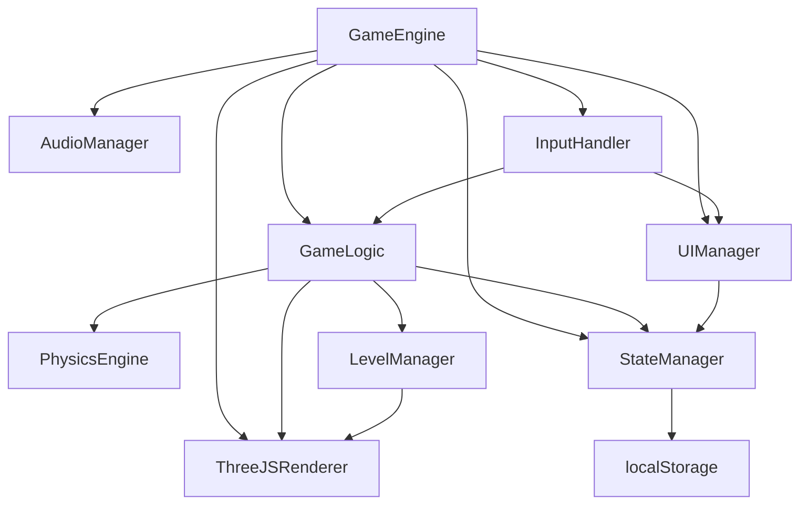

# Component Diagrams

```mermaid
graph TB
    GameEngine[GameEngine]
    Renderer[ThreeJSRenderer]
    Logic[GameLogic]
    Physics[PhysicsEngine]
    State[StateManager]
    Level[LevelManager]
    UI[UIManager]
    Audio[AudioManager]
    Input[InputHandler]
    Storage[localStorage]
    
    GameEngine --> Renderer
    GameEngine --> Logic
    GameEngine --> State
    GameEngine --> UI
    GameEngine --> Audio
    GameEngine --> Input
    
    Logic --> Physics
    Logic --> State
    Logic --> Level
    Logic --> Renderer
    
    Level --> Renderer
    UI --> State
    State --> Storage
    Input --> Logic
    Input --> UI
```
