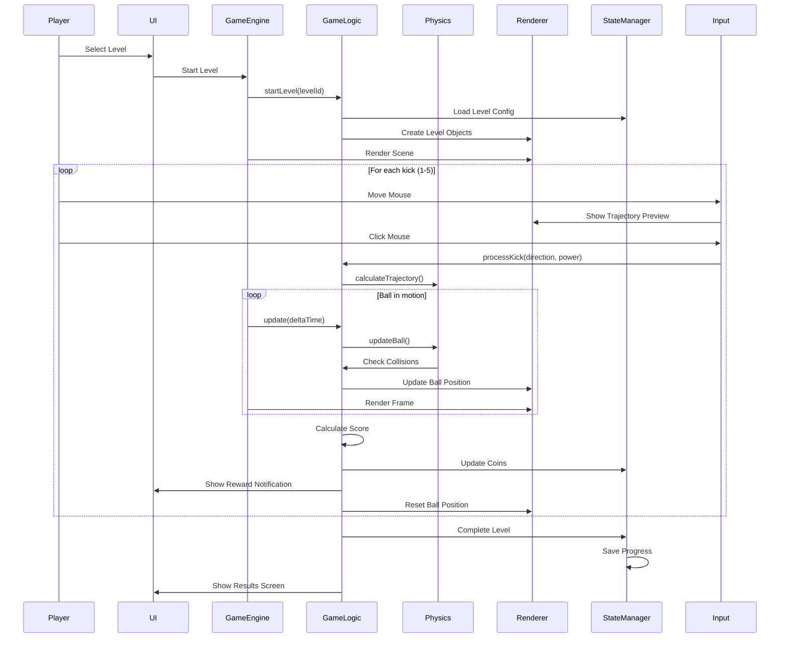
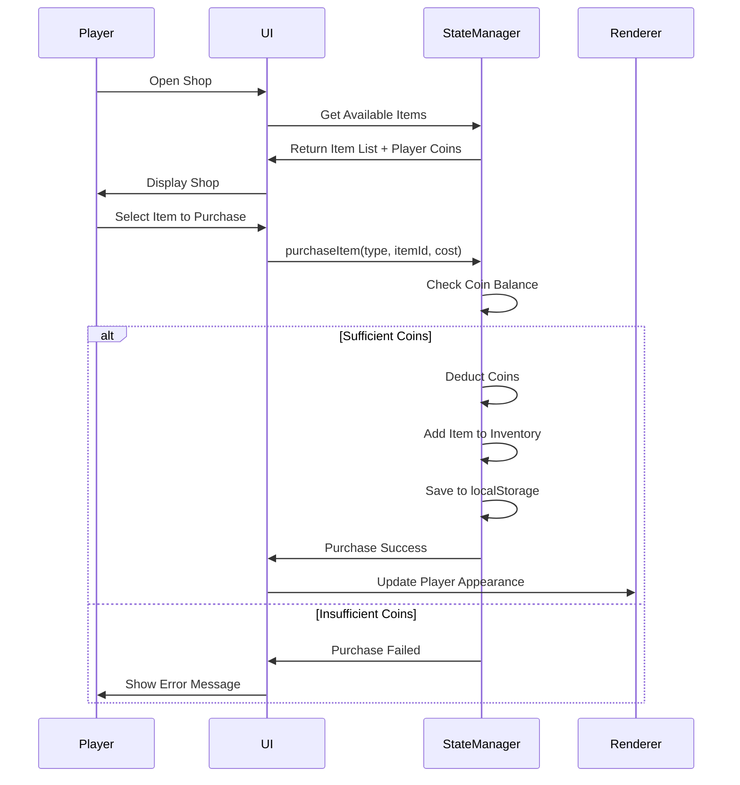

# Core Workflows

## Level Play Workflow

```mermaid
sequenceDiagram
    participant Player
    participant UI
    participant GameEngine
    participant GameLogic
    participant Physics
    participant Renderer
    participant StateManager
    
    Player->>UI: Select Level
    UI->>GameEngine: Start Level
    GameEngine->>GameLogic: startLevel(levelId)
    GameLogic->>StateManager: Load Level Config
    GameLogic->>Renderer: Create Level Objects
    GameEngine->>Renderer: Render Scene
    
    loop For each kick (1-5)
        Player->>Input: Move Mouse
        Input->>Renderer: Show Trajectory Preview
        Player->>Input: Click Mouse
        Input->>GameLogic: processKick(direction, power)
        GameLogic->>Physics: calculateTrajectory()
        
        loop Ball in motion
            GameEngine->>GameLogic: update(deltaTime)
            GameLogic->>Physics: updateBall()
            Physics->>GameLogic: Check Collisions
            GameLogic->>Renderer: Update Ball Position
            GameEngine->>Renderer: Render Frame
        end
        
        GameLogic->>GameLogic: Calculate Score
        GameLogic->>StateManager: Update Coins
        GameLogic->>UI: Show Reward Notification
        GameLogic->>Renderer: Reset Ball Position
    end
    
    GameLogic->>StateManager: Complete Level
    StateManager->>StateManager: Save Progress
    GameLogic->>UI: Show Results Screen
```

## Shop Purchase Workflow

```mermaid
sequenceDiagram
    participant Player
    participant UI
    participant StateManager
    participant Renderer
    
    Player->>UI: Open Shop
    UI->>StateManager: Get Available Items
    StateManager->>UI: Return Item List + Player Coins
    UI->>Player: Display Shop
    
    Player->>UI: Select Item to Purchase
    UI->>StateManager: purchaseItem(type, itemId, cost)
    StateManager->>StateManager: Check Coin Balance
    alt Sufficient Coins
        StateManager->>StateManager: Deduct Coins
        StateManager->>StateManager: Add Item to Inventory
        StateManager->>StateManager: Save to localStorage
        StateManager->>UI: Purchase Success
        UI->>Renderer: Update Player Appearance
    else Insufficient Coins
        StateManager->>UI: Purchase Failed
        UI->>Player: Show Error Message
    end
```
