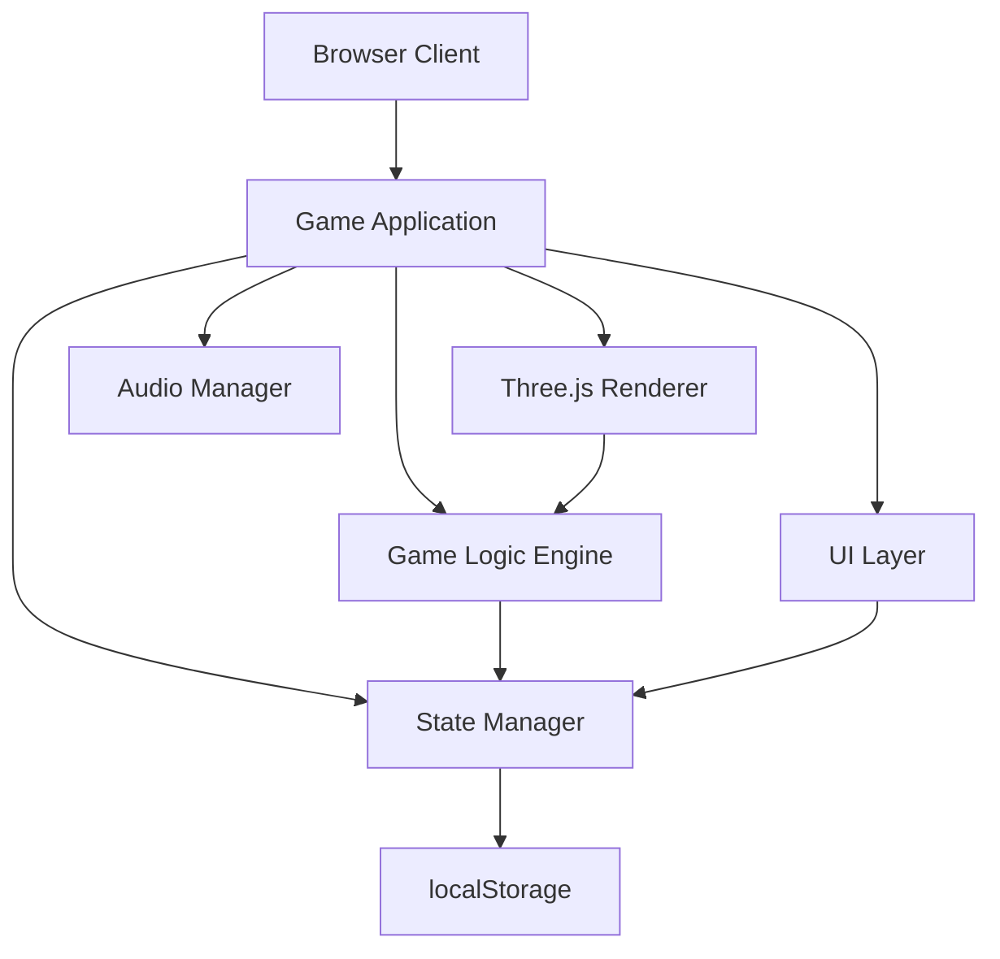

# High Level Architecture

## Technical Summary

Free Kick Master is a client-side monolithic browser application built with Three.js for 3D rendering. The architecture follows a component-based game engine pattern with clear separation between rendering, game logic, state management, and UI layers. All game state is persisted locally using localStorage. The application uses Vite for development tooling and build optimization, ensuring fast load times and 60 FPS performance. This architecture supports the PRD goals of a browser-based game that runs without installation, works in Chrome, and provides smooth 3D gameplay with reward systems.

## High Level Overview

1. **Architectural Style:** Client-side Monolith - All code runs in the browser as a single application bundle
2. **Repository Structure:** Monorepo - Single repository with organized folder structure for code, assets, and documentation
3. **Service Architecture:** N/A - No backend services, all logic is client-side
4. **Primary User Flow:**
   - User opens game in browser → Loads saved progress from localStorage
   - User navigates menus → Selects level → Plays game → Earns coins → Shops for equipment
   - All interactions happen client-side with immediate visual feedback
5. **Key Architectural Decisions:**
   - Three.js for 3D rendering (industry standard, excellent documentation)
   - Component-based game architecture for maintainability
   - Event-driven communication between game systems
   - localStorage for persistence (simple, no backend needed)
   - Vite for build tooling (fast HMR, optimized production builds)

## High Level Project Diagram

## Architectural and Design Patterns

- **Component-Based Architecture:** Game objects (ball, goal, obstacles) are implemented as reusable components with clear interfaces - _Rationale:_ Enables modular development, easier testing, and code reuse across different levels
- **State Management Pattern:** Centralized state manager handles game state, player progress, and UI state - _Rationale:_ Single source of truth, predictable state updates, easier debugging
- **Event-Driven Communication:** Game systems communicate via events (ball kicked, goal scored, level completed) - _Rationale:_ Loose coupling between systems, easier to extend functionality
- **Repository Pattern for Storage:** Abstracted storage layer for localStorage operations - _Rationale:_ Easy to swap storage mechanism if needed, testable storage logic
- **Game Loop Pattern:** Standard game loop (update → render) for consistent frame timing - _Rationale:_ Ensures smooth 60 FPS gameplay, standard game development pattern
